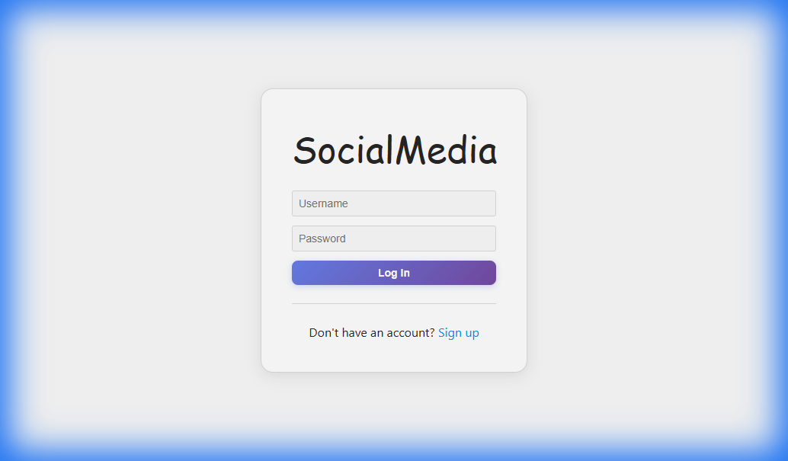
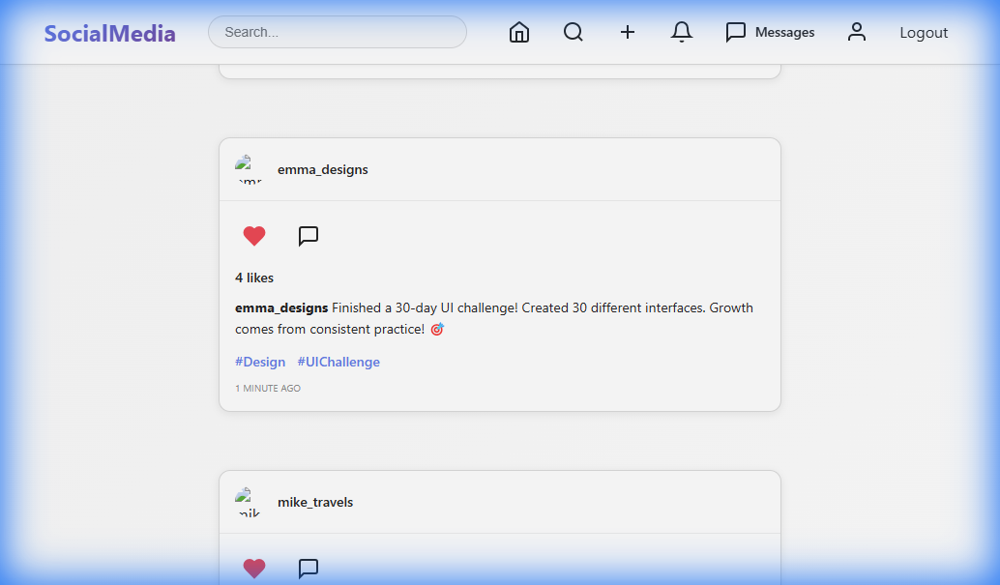
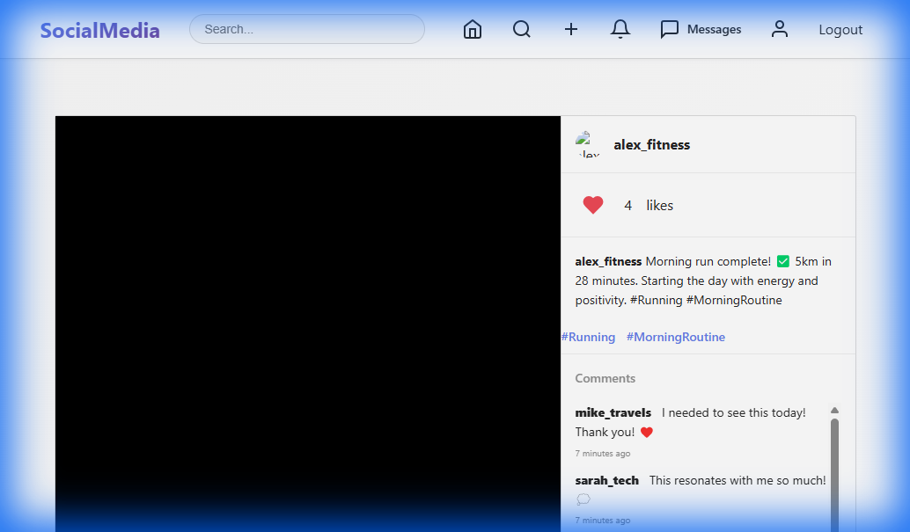
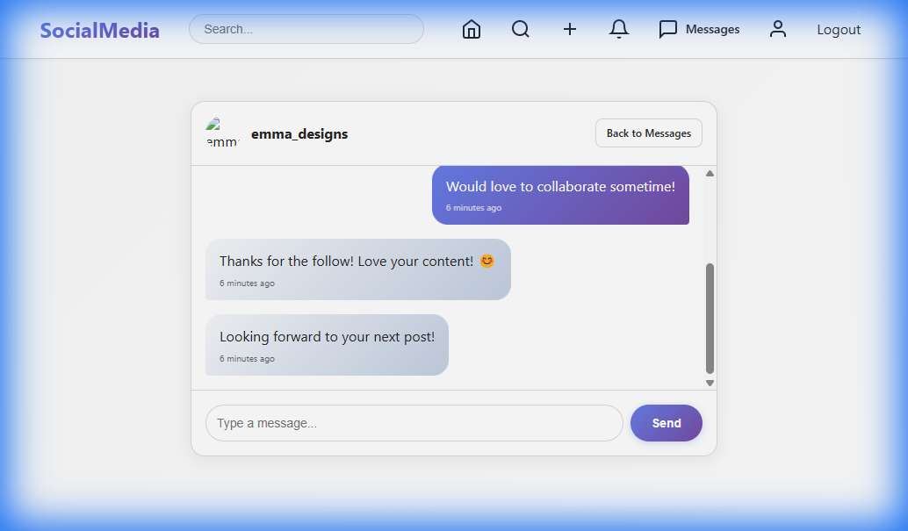
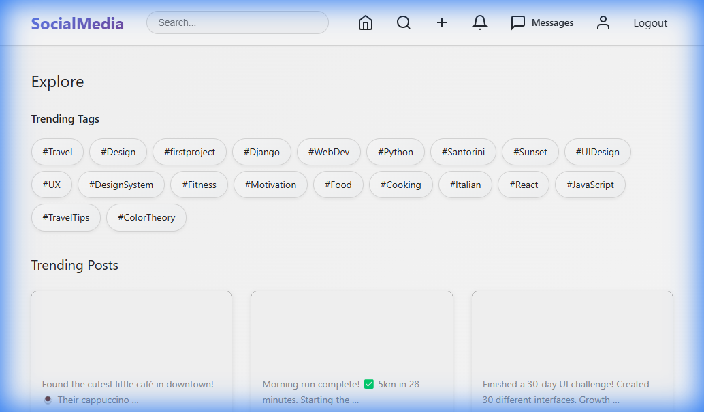
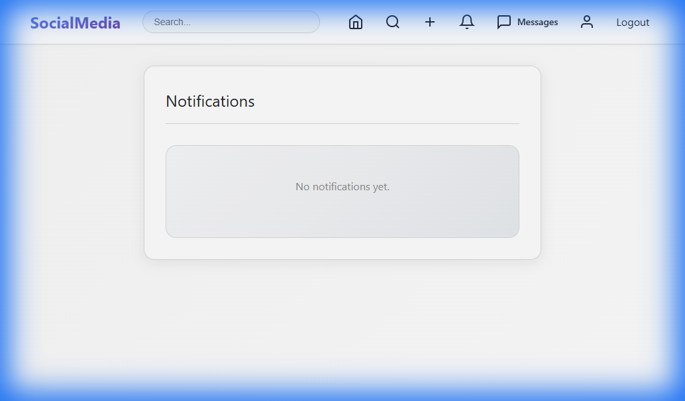

# 🌐 Social Media Platform


A modern, full-featured social media application built with a robust Django backend and a sleek, responsive frontend.

---

## ✨ Features

### 👤 User Core
- **Advanced Profiles**: Customize your profile with pictures, bios, and personal info.
- **Secure Auth**: Full registration, login, and secure password management.
- **Follow System**: Build your network by following other users and managing your followers.

### 📝 Content & Interaction
- **Dynamic Posts**: Share text, images, and videos with your audience.
- **Micro-Interactions**: Like and comment on posts with real-time feedback.
- **Tagging**: Categorize content with hashtags for better discoverability.
- **Trending**: Stay updated with the most popular content on the platform.

### ✉️ Messaging
- **Direct Messaging**: A fully integrated chat system to communicate with your followers instantly.
- **Real-time Notifications**: Get alerted for new followers, likes, and comments.

### 🔍 Discovery
- **Trending Tags**: Explore popular hashtags and discover new content.
- **User Search**: Find and connect with other users on the platform.

---

## 🎯 Live Features Showcase

The application comes with **realistic test data** demonstrating all features in action:

- ✅ **5 Active Users** with complete profiles, bios, and profile pictures
- ✅ **15+ Posts** with varied content including text, hashtags, and media
- ✅ **30+ Likes** distributed across posts showing user engagement
- ✅ **20+ Comments** demonstrating active conversations
- ✅ **12 Follow Relationships** creating a connected social network
- ✅ **25+ Direct Messages** showing real-time communication
- ✅ **Multiple Hashtags** for content categorization and discovery
- ✅ **Active Notifications** for likes, comments, and follows

**Test Credentials:**
- Username: `sarah_tech`, `mike_travels`, `emma_designs`, `alex_fitness`, or `lisa_foodie`
- Password: `password123`

📖 **[View Detailed Feature Documentation →](FEATURES.md)**

---

## 📸 Screenshots

### Authentication & Main Feed
| Login Page | Main Feed |
| :---: | :---: |
|  |  |
| Secure login interface with modern design | Dynamic feed with posts, likes, and comments |

### User Profiles & Interactions
| User Profile | Post Details |
| :---: | :---: |
|  |  |
| Profile with followers/following counts | Individual post with comments and likes |

### Messaging & Discovery
| Direct Messaging | Explore Page |
| :---: | :---: |
|  |  |
| Real-time chat with other users | Discover trending tags and popular posts |

### Notifications
| Notifications Center |
| :---: |
|  |
| Stay updated with likes, comments, and new followers |

---

## 🛠️ Tech Stack

- **Backend**: [Django](https://www.djangoproject.com/) (Python)
- **Database**: SQLite (Development)
- **Frontend**: HTML5, CSS3, JavaScript (ES6+)
- **Storage**: Pillow for image/video processing

---

## 🚀 Quick Start

### 1. Clone the repository
```bash
git clone <repository-url>
cd Social_Media_Apps
```

### 2. Setup Virtual Environment
```bash
python -m venv venv
# Windows
venv\Scripts\activate
# Linux/Mac
source venv/bin/activate
```

### 3. Install Dependencies
```bash
pip install -r requirements.txt
```

### 4. Run Migrations
```bash
python manage.py migrate
```

### 5. (Optional) Populate Test Data
To see the application with realistic demo data:
```bash
python populate_data.py
```
This will create 5 test users, posts, comments, likes, follows, and messages.

### 6. Start Server
```bash
python manage.py runserver
```

Access the application at `http://127.0.0.1:8000/`

---

## 📁 Project Structure

```text
Social_Media_Apps/
├── core/                 # Main application logic (models, views, forms)
├── socialmedia/          # Project settings & configuration
├── templates/            # HTML templates organized by module
├── static/               # CSS, JS, and image assets
├── media/                # User-uploaded content (images, videos)
├── screenshots/          # Documentation assets
└── manage.py             # Django management CLI
```

---

## 🤝 Contributing

Contributions are welcome! Please feel free to submit a Pull Request. See [CONTRIBUTING.md](CONTRIBUTING.md) for details.

## 📄 License

This project is licensed under the MIT License - see the [LICENSE](LICENSE) file for details.

---
*Developed with ❤️ by Spandan Gowda*
